# Principles Of Programming Languages & Compilers

This repository contains the course project for the **Principles Of Programming Languages & Compilers**
university course for the academic period of 2018-2019 done by <a
href="https://github.com/PARVD0XSVPR3ME">Panagiotis Charalampopoulos</a>.

## Table Of Contents

- [Project Objectives](#project-objectives)
- [Subgroup of the Microsoft Excel XML format](#subgroup-of-the-microsoft-excel-xml-format)
- [Backus–Naur form (BNF) Grammar](#backus-naur-form-grammar)
- [Compilation Instructions](#compilation-instructions)
- [Usage](#usage)
- [Screenshots](#screenshots)
- [License](#license)

<small><i><a href='http://ecotrust-canada.github.io/markdown-toc/'>Table of contents generated with markdown-toc</a></i></small>

## Project Objectives

The objectives of this project are the following:
   1. Define a **BNF grammar** for a **subgroup of the Microsoft Excel XML format** that is described below.
   2. Implement a parser using the **Flex** lexical analyzer generator and the **GNU Bison** parser generator.
      The parser takes as an input a file written in the **subgroup of the Microsoft Excel XML format** that is
      described below, checks in one pass if the input file is syntactically correct and prints it having
      applied the appropriate indentation along with a diagnostic message that informs us that the input file
      is valid or an error message that informs us the line that the error was found.

      The parser also performs checks to ensure that :
         1. When there are `<ss:Style>` elements, the value of their `ss:ID` attribute is **unique**.
         2. When there is a `ss:StyleID` attribute, its value has been declared earlier as a value of an
            `ss:ID` attribute.
         3. When there is a `ss:ExpandedColumnCount` attribute, the number of `<ss:Column>` elements must be equal
            to the value of the `ss:ExpandedColumnCount` attribute.
         4. When there is a `ss:ExpandedRowCount` attribute, the number of `<ss:Row>` elements must be equal
            to the value of the `ss:ExpandedRowCount` attribute.

## Subgroup of the Microsoft Excel XML format

The subgroup consist of the following XML elements:

- `<ss:Workbook>`
- `<ss:Styles>`
- `<ss:Style>`
- `<ss:Worksheet>`
- `<ss:Table>`
- `<ss:Column/>`
- `<ss:Row>`
- `<ss:Cell>`
- `<ss:Data>`

The following rules apply:

1. `<ss:Workbook>` is the root element.
2. `<ss:Workbook>` must contain at least one `<ss:Worksheet>` element and can optionally contain `<ss:Styles>`
   elements. If there are any `<ss:Styles>` elements must be putted before the first `<ss:Worksheet>`
   element.
3. `<ss:Styles>` contains optional `<ss:Style>` elements.
4. `<ss:Style>` is an empty element (contains no content) which must contain the required `ss:ID` attribute. `ss:ID`
   value must be a string.
5. `<ss:Worksheet>` contains optional `<ss:Table>` elements. `<ss:Worksheet>` must contain the required
   `ss:Name` attribute and it can optionally contain the `ss:Protected` attribute. `ss:Name` value must be a
   string and `ss:Protected` value must be boolean.
6. `<ss:Table>` contains optional `<ss:Column/>` and `<ss:Row>` elements which must be putted in this order if
   an `ss:Table` contains both of them. `<ss:Table>` can also optionally contain the `ss:ExpandedColumnCount`,
   `ss:ExpandedRowCount` and `ss:StyleID` attributes. `ss:ExpandedColumnCount` and `ss:ExpandedRowCount` value
   must be a positive integer and `ss:StyleID` value must be a string.
7. `<ss:Column/>` is an empty element (contains no content) which can optionally contain the `ss:Hidden`,
   `ss:Width` and `ss:StyleID` attributes. `ss:Hidden` value must be boolean, `ss:Width` value must be
   positive integer and `ss:StyleID` value must be a string.
8. `<ss:Row>` contains optional `<ss:Cell>` elements and optional `ss:Height`, `ss:Hidden` and `ss:StyleID`
   attributes. `ss:Hidden` value must be boolean, `ss:Height` value must be a positive integer and
   `ss:StyleID` value must be a string.
9. `<ss:Cell>` contains optional `<ss:Data>` elements and optional `ss:MergeAcross`, `ss:MergeDown` and
   `ss:StyleID` attributes. `ss:MergeAcross` and `ss:MergeDown` value must be a positive integer and
   `ss:StyleID` value must be a string.
10. `<ss:Data>` must contain the required `ss:Type` attribute. `ss:Type` value can be `Number`, `DateTime`,
    `Boolean` or `String`. `<ss:Data>` content can be text or can be leaved empty.
11. XML comments are supported at any point in the code.


## Backus Naur form Grammar

```
<workbook> ::= BEGIN_WORKBOOK CLOSETAG <styles> <worksheet> END_WORKBOOK CLOSETAG
   | <comments> BEGIN_WORKBOOK CLOSETAG <styles> <worksheet> END_WORKBOOK CLOSETAG
   | BEGIN_WORKBOOK CLOSETAG <styles> <worksheet> END_WORKBOOK CLOSETAG <comments>
   | <comments> BEGIN_WORKBOOK CLOSETAG <styles> <worksheet> END_WORKBOOK CLOSETAG <comments>
   | BEGIN_WORKBOOK CLOSETAG <comments> <styles> <worksheet> END_WORKBOOK CLOSETAG
   | <comments> BEGIN_WORKBOOK CLOSETAG <comments> <styles> <worksheet> END_WORKBOOK CLOSETAG
   | BEGIN_WORKBOOK CLOSETAG <comments> <styles> <worksheet> END_WORKBOOK CLOSETAG <comments>
   | <comments> BEGIN_WORKBOOK CLOSETAG <comments> <styles> <worksheet> END_WORKBOOK CLOSETAG <comments>

<styles> ::= /*empty*/
   | <styles> BEGIN_STYLES CLOSETAG <style> END_STYLES CLOSETAG <comments>
   | <styles> BEGIN_STYLES CLOSETAG <style> END_STYLES CLOSETAG
   | <styles> BEGIN_STYLES CLOSETAG <style> <comments> END_STYLES CLOSETAG <comments>
   | <styles> BEGIN_STYLES CLOSETAG <style> <comments> END_STYLES CLOSETAG

<style> ::= /*empty*/
   | <style> BEGIN_STYLE ID_EQUALS_QUOTE ID_STRING QUOTE CLOSETAG END_STYLE CLOSETAG
   | <style> <comments> BEGIN_STYLE ID_EQUALS_QUOTE ID_STRING QUOTE CLOSETAG END_STYLE CLOSETAG
   | <style> BEGIN_STYLE ID_EQUALS_QUOTE ID_STRING QUOTE CLOSETAG <comments> END_STYLE CLOSETAG
   | <style> <comments> BEGIN_STYLE ID_EQUALS_QUOTE ID_STRING QUOTE CLOSETAG <comments> END_STYLE CLOSETAG

<worksheet> ::= <worksheet_cont>
   | <worksheet> <worksheet_cont>

<worksheet_cont> ::= BEGIN_WORKSHEET <worksheet_attr> CLOSETAG <table> END_WORKSHEET CLOSETAG
   | BEGIN_WORKSHEET <worksheet_attr> CLOSETAG <table> END_WORKSHEET CLOSETAG <comments>
   | BEGIN_WORKSHEET <worksheet_attr> CLOSETAG <comments> <table> END_WORKSHEET CLOSETAG
   | BEGIN_WORKSHEET <worksheet_attr> CLOSETAG <comments> <table> END_WORKSHEET CLOSETAG <comments>

<worksheet_attr> ::= <name> <protected>
   | <protected> <name>
   | <name>

<name> ::= NAME_EQUALS_QUOTE STRING QUOTE

<protected> ::= PROTECTED_EQUALS_QUOTE BOOLEAN QUOTE

<table> ::= /*empty*/
   | <table> BEGIN_TABLE <table_attr> CLOSETAG <table_elements> END_TABLE CLOSETAG
   | <table> BEGIN_TABLE <table_attr> CLOSETAG <table_elements> END_TABLE CLOSETAG <comments>
   | <table> BEGIN_TABLE <table_attr> CLOSETAG <comments> <table_elements> END_TABLE CLOSETAG
   | <table> BEGIN_TABLE <table_attr> CLOSETAG <comments> <table_elements> END_TABLE CLOSETAG <comments>

<table_attr> ::= /*empty*/
   | <expcolcount>
   | <exprowcount>
   | <styleid>
   | <expcolcount> <exprowcount>
   | <exprowcount> <expcolcount>
   | <expcolcount> <styleid>
   | <styleid> <expcolcount>
   | <exprowcount> <styleid>
   | <styleid> <exprowcount>
   | <expcolcount> <exprowcount> <styleid>
   | <expcolcount> <styleid> <exprowcount>
   | <exprowcount> <expcolcount> <styleid>
   | <exprowcount> <styleid> <expcolcount>
   | <styleid> <exprowcount> <expcolcount>
   | <styleid> <expcolcount> <exprowcount>

<expcolcount> ::= EXPANDEDCOLUMNCOUNT_EQUALS_QUOTE POSITIVE_INT QUOTE

<exprowcount> ::= EXPANDEDROWCOUNT_EQUALS_QUOTE POSITIVE_INT QUOTE

<styleid> ::= STYLEID_EQUALS_QUOTE ID_STRING QUOTE

<table_elements> ::= /*empty*/
   | <column>
   | <row>
   | <column> <row>

<column> ::= BEGIN_COLUMN <column_attr> SELFCLOSINGTAG
   | <column> BEGIN_COLUMN <column_attr> SELFCLOSINGTAG
   | BEGIN_COLUMN <column_attr> SELFCLOSINGTAG <comments>
   | <column> BEGIN_COLUMN <column_attr> SELFCLOSINGTAG <comments>

<column_attr> ::= /*empty*/
   | <hidden>
   | <width>
   | <styleid>
   | <hidden> <width>
   | <width> <hidden>
   | <hidden> <styleid>
   | <styleid> <hidden>
   | <width> <styleid>
   | <styleid> <width>
   | <hidden> <width> <styleid>
   | <hidden> <styleid> <width>
   | <width> <hidden> <styleid>
   | <width> <styleid> <hidden>
   | <styleid> <width> <hidden>
   | <styleid> <hidden> <width>

<hidden> ::= HIDDEN_EQUALS_QUOTE BOOLEAN QUOTE

<width> ::= WIDTH_EQUALS_QUOTE POSITIVE_INT QUOTE

<row> ::= BEGIN_ROW <row_attr> CLOSETAG <cell> END_ROW CLOSETAG
   | <row> BEGIN_ROW <row_attr> CLOSETAG <cell> END_ROW CLOSETAG
   | BEGIN_ROW <row_attr> CLOSETAG <cell> END_ROW CLOSETAG <comments>
   | <row> BEGIN_ROW <row_attr> CLOSETAG <cell> END_ROW CLOSETAG <comments>
   | BEGIN_ROW <row_attr> CLOSETAG <comments> <cell> END_ROW CLOSETAG
   | <row> BEGIN_ROW <row_attr> CLOSETAG <comments> <cell> END_ROW CLOSETAG
   | BEGIN_ROW <row_attr> CLOSETAG <comments> <cell> END_ROW CLOSETAG <comments>
   | <row> BEGIN_ROW <row_attr> CLOSETAG <comments> <cell> END_ROW CLOSETAG <comments>

<row_attr> ::= /*empty*/
   | <hidden>
   | <height>
   | <styleid>
   | <hidden> <height>
   | <height> <hidden>
   | <hidden> <styleid>
   | <styleid> <hidden>
   | <height> <styleid>
   | <styleid> <height>
   | <hidden> <height> <styleid>
   | <hidden> <styleid> <height>
   | <height> <hidden> <styleid>
   | <height> <styleid> <hidden>
   | <styleid> <height> <hidden>
   | <styleid> <hidden> <height>

<height> ::= HEIGHT_EQUALS_QUOTE POSITIVE_INT QUOTE

<cell> ::= /*empty*/
   | <cell> BEGIN_CELL <cell_attr> CLOSETAG <data> END_CELL CLOSETAG
   | <cell> BEGIN_CELL <cell_attr> CLOSETAG <data> END_CELL CLOSETAG <comments>
   | <cell> BEGIN_CELL <cell_attr> CLOSETAG <comments> <data> END_CELL CLOSETAG
   | <cell> BEGIN_CELL <cell_attr> CLOSETAG <comments> <data> END_CELL CLOSETAG <comments>

<cell_attr> ::= /*empty*/
   | <mergedown>
   | <mergeacross>
   | <styleid>
   | <mergedown> <mergeacross>
   | <mergeacross> <mergedown>
   | <mergedown> <styleid>
   | <styleid> <mergedown>
   | <mergeacross> <styleid>
   | <styleid> <mergeacross>
   | <mergedown> <mergeacross> <styleid>
   | <mergedown> <styleid> <mergeacross>
   | <mergeacross> <mergedown> <styleid>
   | <mergeacross> <styleid> <mergedown>
   | <styleid> <mergeacross> <mergedown>
   | <styleid> <mergedown> <mergeacross>

<mergedown> ::= MERGEDOWN_EQUALS_QUOTE POSITIVE_INT QUOTE

<mergeacross> ::= MERGEACROSS_EQUALS_QUOTE POSITIVE_INT QUOTE

<data> ::= /*empty*/
   | <data> BEGIN_DATA TYPE_EQUALS_QUOTE DATA_TYPE QUOTE CLOSETAG DATA_TEXT ENDOPENTAG DATA CLOSETAG
   | <data> BEGIN_DATA TYPE_EQUALS_QUOTE DATA_TYPE QUOTE CLOSETAG DATA_TEXT ENDOPENTAG DATA CLOSETAG <comments>
   | <data> BEGIN_DATA TYPE_EQUALS_QUOTE DATA_TYPE QUOTE CLOSETAG <comments> DATA_TEXT ENDOPENTAG DATA CLOSETAG
   | <data> BEGIN_DATA TYPE_EQUALS_QUOTE DATA_TYPE QUOTE CLOSETAG DATA_TEXT <comments> ENDOPENTAG DATA CLOSETAG
   | <data> BEGIN_DATA TYPE_EQUALS_QUOTE DATA_TYPE QUOTE CLOSETAG <comments> DATA_TEXT <comments> ENDOPENTAG DATA CLOSETAG
   | <data> BEGIN_DATA TYPE_EQUALS_QUOTE DATA_TYPE QUOTE CLOSETAG <comments> DATA_TEXT ENDOPENTAG DATA CLOSETAG <comments>
   | <data> BEGIN_DATA TYPE_EQUALS_QUOTE DATA_TYPE QUOTE CLOSETAG DATA_TEXT <comments> ENDOPENTAG DATA CLOSETAG <comments>
   | <data> BEGIN_DATA TYPE_EQUALS_QUOTE DATA_TYPE QUOTE CLOSETAG <comments> DATA_TEXT <comments> ENDOPENTAG DATA CLOSETAG <comments>

<comments> ::= OPEN_COMMMENTS COMMENTS CLOSE_COMMMENTS
   | <comments> OPEN_COMMMENTS COMMENTS CLOSE_COMMMENTS
```


## Compilation Instructions
A `Makefile` is included so assuming `gcc` is installed you can simply run `make` inside this repo to generate
the `parser` executable.

## Usage

`./parser <input_file>`

## Screenshots

1. Valid input file

   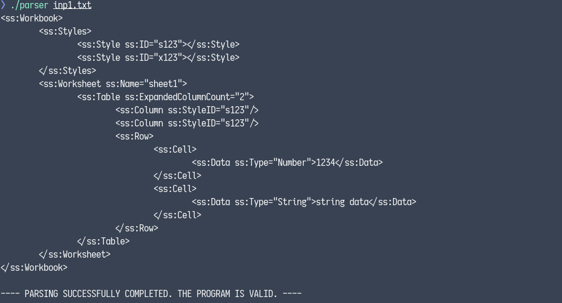
   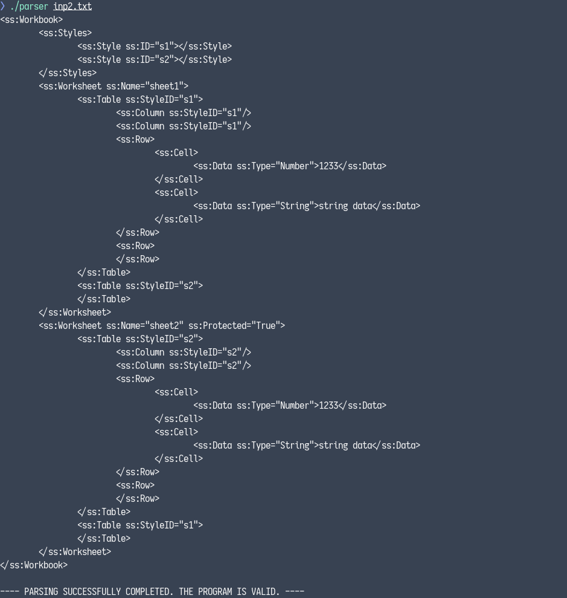

2. The `<ss:Styles>` tag is missing so the parser throws an error.

   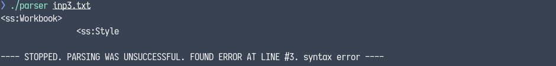

3. The value of `ss:Protected` attribute was set to `a` (`ss:Protected="a"`) so the parser throws an error
   because the `ss:Protected` attribute is expecting a boolean value.

   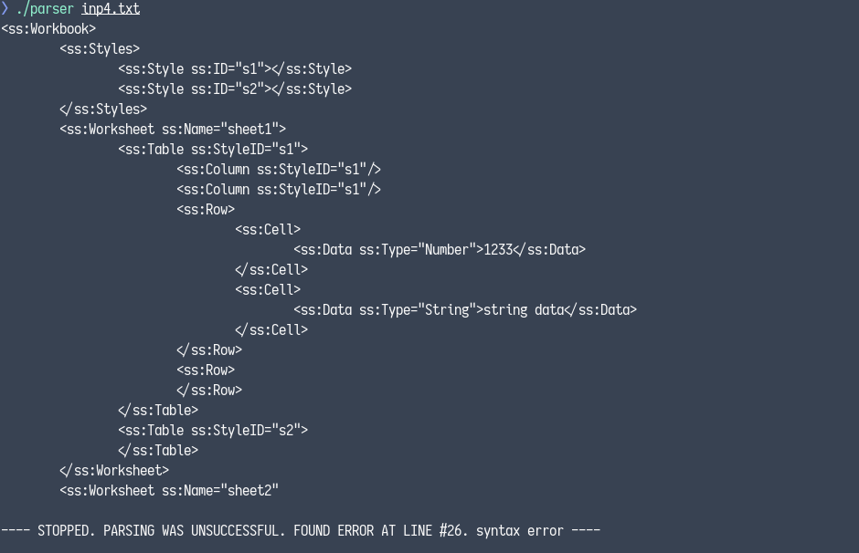

4. The parser throws an error because the value of `ss:ID` attribute must be unique.

   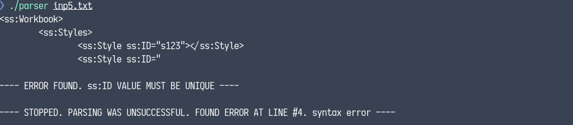

5. The parser throws an error because the value of the `ss:StyleID` attribute has not been declared earlier as
   a value of an `ss:ID` attribute.

   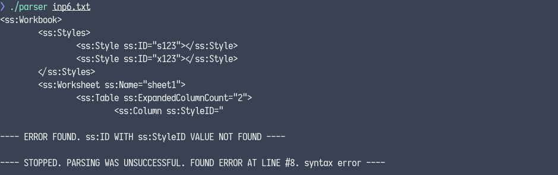

6. The parser throws an error because the number of `<ss:Column>` elements is not equal to the value of the
   `ss:ExpandedColumnCount` attribute.

   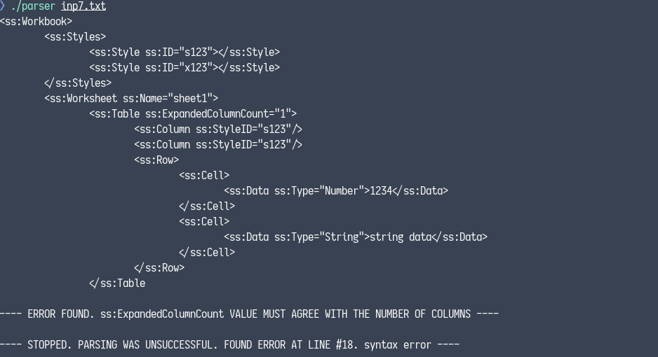

   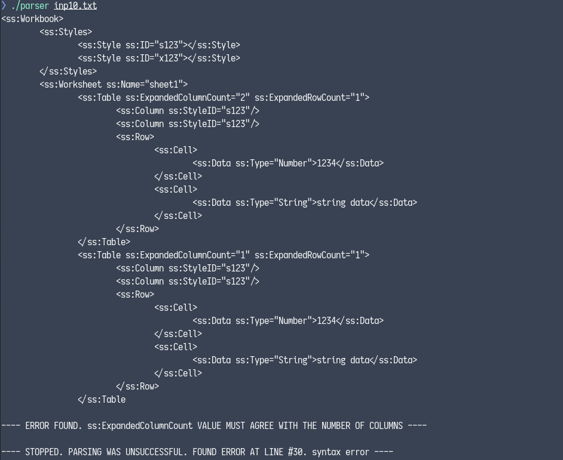

7. The number of `<ss:Row>` elements is not equal to the value of the `ss:ExpandedRowCount` attribute.

   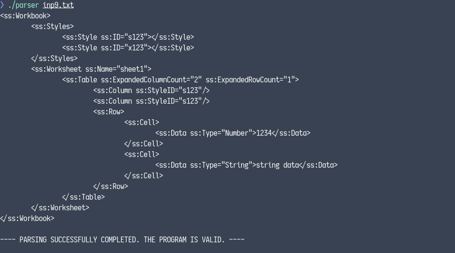

8. The parser throws an error because the number of `<ss:Row>` elements is not equal to the value of the
   `ss:ExpandedRowCount` attribute.

   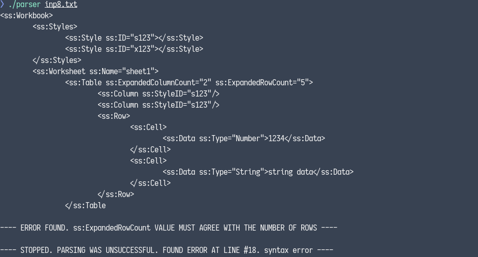

   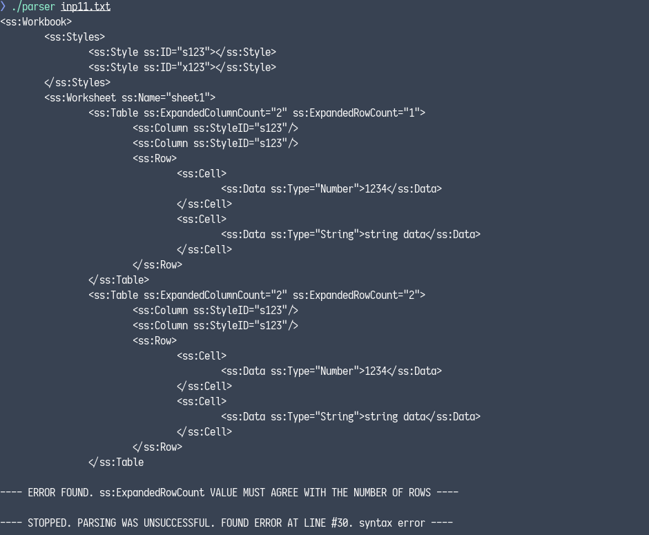

# License
All files except `Askisi2018.pdf` are licensed under the
[AGPL-3.0](https://www.gnu.org/licenses/agpl-3.0.en.html) license.

Copyright © <a href="https://github.com/PARVD0XSVPR3ME">Panagiotis Charalampopoulos</a>
